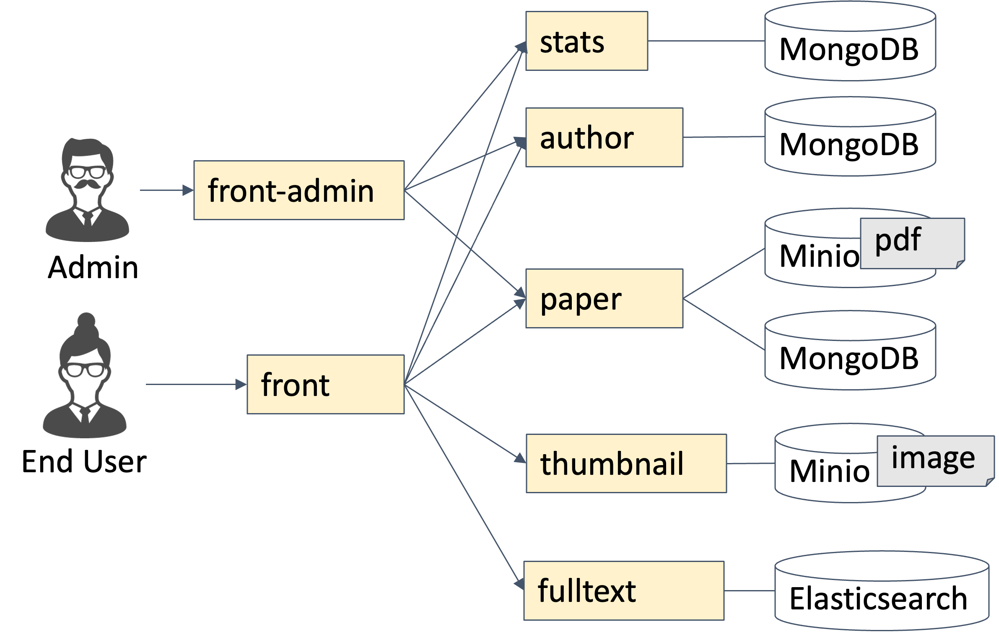

# doktor-v2

Doktor is a demo web application that is implemented as microservice architecture.
This web application provides search and download of technical reports.

https://github.com/user-attachments/assets/4088fd6a-bb87-4852-be16-d95f09c7ddf0

## Architecture

Microservices are deployed on Kubernetes cluster. Istio is utilized for service mesh in this system.

## Development

If you are interested in development, you can read [developer guides](./DEVELOP_GUIDE.md).

API Documents is here.

https://cdsl-research.github.io/doktor-v2/

## Branch Policy

- `master`
  - Latest and Stable release
  - Create a pull request to this
- `staging`
  - Staging release (equal to staging environment)
  - Create a pull request to this on staging release
  - http://doktor-prod1:30200/
- `production`
  - Production release (equal to production environment)
  - Create a pull request to this after staging release
  - https://doktor.tak-cslab.org/

## Directory Structure

Tools:

- `deploy` deploy scripts
- `dev_tools` development scripts

Microservices:

- `author` Manage authors
- `front` Provide Web UI for end users
- `front-admin` Provide management console
- `fulltext` Provide fulltext search for papers
- `paper` Manage papers
- `stats` Manage access history
- `textize` Get text from pdf files
- `thumbnail` Managing figures in papers

