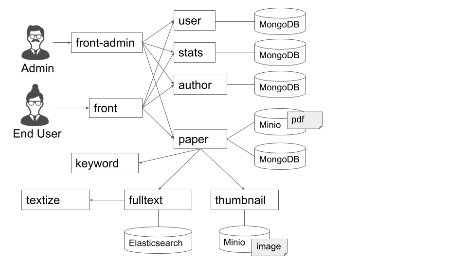

# doktor-v2

This is doktor v2.

## Architecture



## Directory Structure

- `author` 著者を管理するサービス
- `dev_tools` 開発用のツール群
- `front` ユーザが操作するWeb UIのサービス
- `paper` 論文を管理するサービス

## Development Guide

それぞれのディレクトリに移動して，以下を実行する．

```
make compose
```

## Setup for Local Development

以下のパッケージをインストールする．

- Docker for Desktop
- docker-compose
- GNU Make
- Python 3.9 or later
